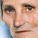

# Content
[IMDb dataset](./IMDB.md)

[Rijksmuseum dataset](./Rijks.md)

[CycleGANN Monet2Photo results](./Monet2PhotoResults.md)

[CycleGANN Nightwatch results](./NightwatchResults.md)

[CycleGANN IMDB to Rijksmuseum full painting](./IMDB2RijksFullResults.md)

[CycleGANN IMDB to Rijksmuseum face only](./README.md)

[Perceived sex classification performance](./ClassificationResults.md) (this file)

# Perceived sex classification performance
## Rijksmuseum original faces

| | Classified female | Classified male | Total count| Performance |
 --- | --- | --- | --- | --- 
Actual female|281|218|499|56.31%
Actual male|77|929|1,006|92.35%
Total|358|1,147|1,505|**80.40%**
## Style transferred faces

| | Classified female | Classified male | Total count| Performance |
 --- | --- | --- | --- | --- 
Actual female|280|219|499|56.11%
Actual male|74|932|1,006|92.64%
Total|354|1,151|1,505|**80.53%**

## Gann transformed paintings

| | Classified female | Classified male | Total count| Performance |
 --- | --- | --- | --- | --- 
Actual female|309|190|499|61.92%
Actual male|148|858|1,006|85.29%
Total|457|1,048|1,505|**77.54%**

## Gann transformed faces

| | Classified female | Classified male | Total count| Performance |
 --- | --- | --- | --- | --- 
Actual female|366|133|499|73.35%
Actual male|228|779|1,006|77.43%
Total|594|912|1,505|**76.08%**
