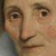

# Table of Contents
[IMDb dataset](./IMDB.md)

[Rijksmuseum dataset](./Rijks.md)

[CycleGANN Monet2Photo results](./Monet2PhotoResults.md)

[CycleGANN Nightwatch results](./NightwatchResults.md)

[CycleGANN IMDB to Rijksmuseum full painting](./IMDB2RijksFullResults.md)

[CycleGANN IMDB to Rijksmuseum face only](./README.md) (this file)

[Perceived sex classification performance](./ClassificationResults.md)
# Painting to Photo using CycleGann
Source: https://github.com/junyanz/pytorch-CycleGAN-and-pix2pix

Cite:
```bibtex
@article{zhu2017unpaired,
  title={Unpaired image-to-image translation using cycle-consistent adversarial networks},
  author={Zhu, Jun-Yan and Park, Taesung and Isola, Phillip and Efros, Alexei A},
  journal={arXiv preprint},
  year={2017}
}
```
# IMDB to Rijks training
Author's implementation on the Monet2Photo model is trained with 1072 Monet painting samples and 6,287 nature photographs over 200 epochs (takes approximately 15 days with a single GPU). We have used 1234 Rijksmuseum paintings and 10,223 IMDb pictures with the same architecture. Training process took almost 18 days on Intel i5-6600 @3.30GHz equipped with NVIDIA GeForge GTX 1070 (Aero 8G OC V330 – 011R).

## IMDB to Rijks trained
Faces from Rijksmuseum paintings → Painting face to photo results


→ 


→ 


→ 


→ 


→ 


→ 


→ 


→ 


→ 
