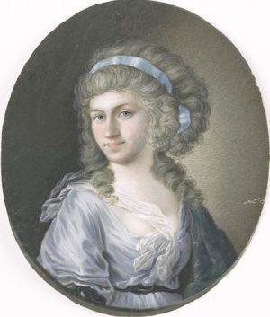
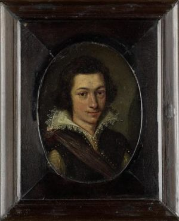
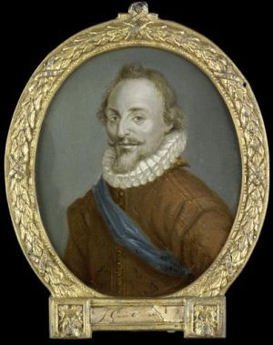
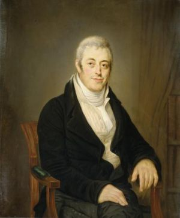
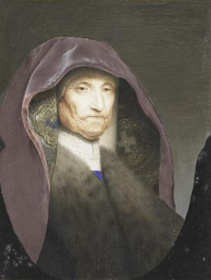
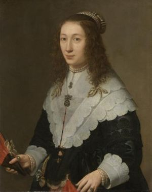

# Table of Contents
[IMDb dataset](./IMDB.md)

[Rijksmuseum dataset](./Rijks.md) (this file)

[CycleGANN Monet2Photo results](./Monet2PhotoResults.md)

[CycleGANN Nightwatch results](./NightwatchResults.md)

[CycleGANN IMDB to Rijksmuseum full painting](./IMDB2RijksFullResults.md)

[CycleGANN IMDB to Rijksmuseum face only](./README.md)

[Perceived sex classification performance](./ClassificationResults.md)
# Rijksmuseum Sample Paintings

